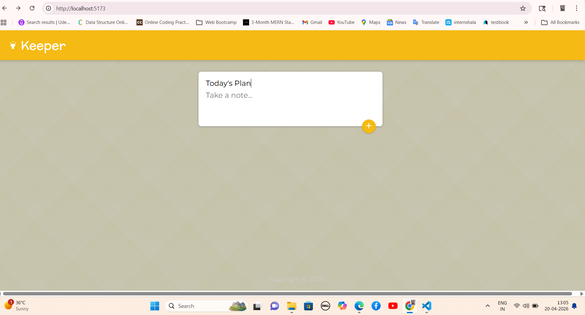
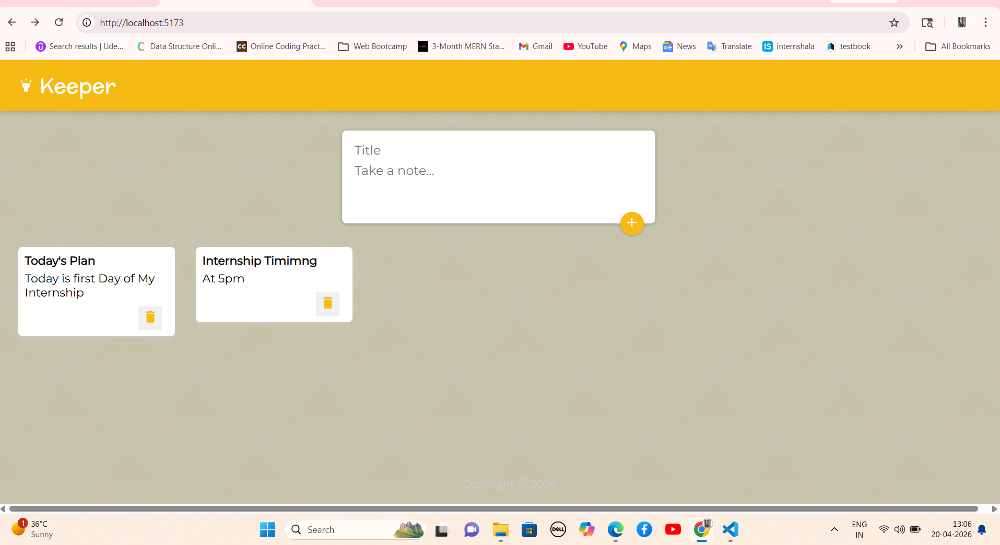
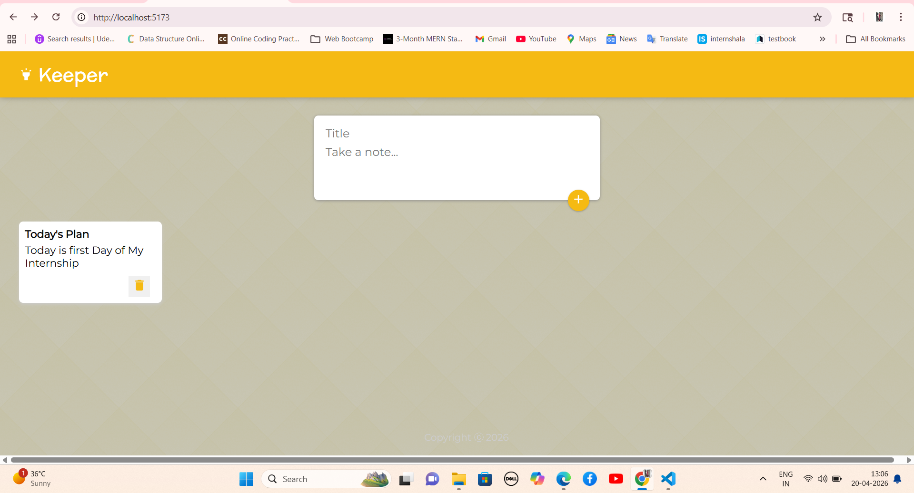

# 📝 Keeper App (React Notes Application)


---

## 📌 Introduction

The **Keeper App** is a simple and interactive note-taking web application developed using **React.js**.  
It allows users to create, store, and delete notes dynamically in a clean and user-friendly interface.

This project demonstrates the use of **React components, hooks, and state management** to build a real-time application similar to Google Keep.

---

## 🎯 Objectives of Proposed System

The main objectives of this project are:

- To develop a **dynamic note-taking application**
- To understand **React functional components and hooks**
- To implement **state management using useState**
- To perform **CRUD operations (Create, Delete)**
- To design a **responsive and interactive UI**
- To improve frontend development skills  

---

## 🌐 Scope of Proposed System

The scope of this system includes:

- Creating and managing personal notes  
- Expanding input fields dynamically  
- Deleting notes instantly  
- Providing a simple and minimal UI  

### Future Scope:
- 🔐 User authentication  
- ☁️ Cloud storage integration  
- ✏️ Edit/update notes  
- 📱 Mobile responsive enhancement  
- 🔍 Search and filter notes  

---

## 🚀 Features

- 📝 Add new notes  
- 🗑️ Delete notes  
- 📌 Dynamic UI expansion  
- ⚡ Real-time updates  
- 🎨 Clean and minimal design  
- 🔄 Component-based architecture  

---

## 🛠️ Tech Stack

| Technology | Usage |
|----------|------|
| React.js | Frontend |
| JavaScript | Logic |
| HTML | Structure |
| CSS | Styling |
| Material-UI | Icons & UI Components |

---

## 📂 File Designing (Project Structure)

```bash
keeper-app/
│
├── public/
│   └── index.html
│
├── src/
│   ├── components/
│   │   ├── App.jsx
│   │   ├── Header.jsx
│   │   ├── Footer.jsx
│   │   ├── Note.jsx
│   │   └── CreateArea.jsx
│   │
│   ├── index.jsx
│   └── styles.css
│
├── package.json
├── README.md
└── .gitignore
```

---

## 🧾 Input Screen (Screenshots)

👉 Add your screenshots here:

```markdown




```

> 📌 Create a `screenshots` folder and add images

---

## ⚙️ How It Works

- User clicks on input area  
- Input expands to show title field  
- User enters title and content  
- Clicks ➕ button to add note  
- Note is displayed dynamically  
- User can delete note using delete button  

---

## 💻 Core Logic (React)

### Add Note

```javascript
function addNote(newNote) {
  setNotes(prevNotes => {
    return [...prevNotes, newNote];
  });
}
```

---

### Delete Note

```javascript
function deleteNote(id) {
  setNotes(prevNotes => {
    return prevNotes.filter((noteItem, index) => {
      return index !== id;
    });
  });
}
```

---

### State Management

```javascript
const [notes, setNotes] = useState([]);
```

---

## 📦 Dependencies

Install required packages:

```bash
npm install
npm install @material-ui/core @material-ui/icons
```

---

## ▶️ How To Run The Project

```bash
npm install
npm run dev
```

Open browser:

```
http://localhost:5173
```

---

## 💡 Additional Improvements

- ✏️ Edit notes feature  
- 📌 Pin important notes  
- 🌙 Dark mode  
- 🔍 Search functionality  
- ☁️ Database integration (MongoDB / Firebase)  

---

## 🎓 What You Learned

- React component structure  
- useState hook  
- Props and event handling  
- Dynamic rendering  
- UI interaction design  

---

## ⚠️ Note

This project is developed for **learning and practice purposes** to understand React fundamentals and frontend development.

---

## 👩‍💻 Author

**Prarthana Basawraj Bhandari**  
*MCA Student*

---
